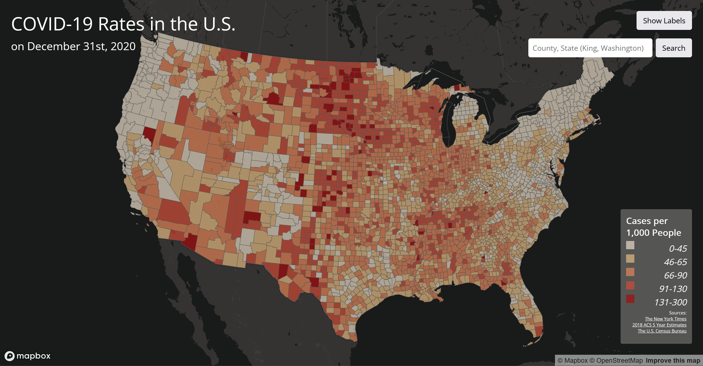
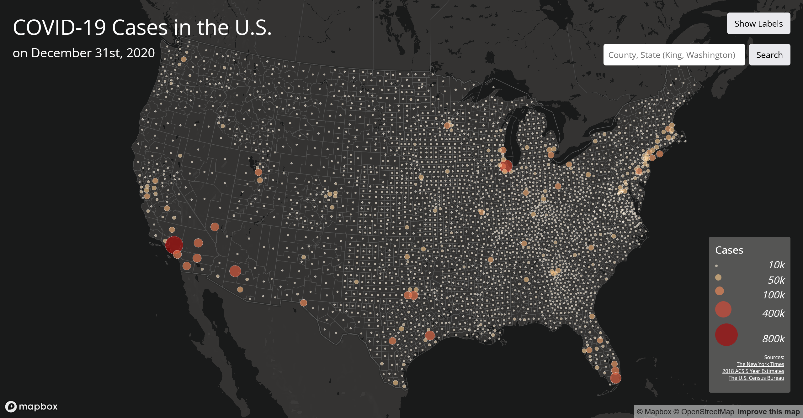

# COVID-19 Web Maps: U.S. County Level Cases & Rates

  
AI Disclosure

    I used AI in this assignment for debugging only. I did not use AI to write or complete any components where AI use is prohibited. I am able to explain all relevant code and decisions.

---

## Project Overview

This project presents two interactive web-based maps that visualize COVID-19 cases and case rates across counties in the United States on December 31, 2020. The maps were designed to support exploratory spatial analysis by allowing users to interactively examine geographic patterns of pandemic impacts at the county level. The maps are built using Mapbox GL JS and integrate multiple datasets to provide both normalized and absolute representations of COVID-19 spread.

This project consists of two complementary thematic maps:

- Map 1: A choropleth map displaying COVID-19 rates per 1,000 residents
- Map 2: A proportional symbols map displaying total COVID-19 case counts

Together, these two maps allow for the exploration of both relative risk (rates) and absolute burden (case counts). This dual-map approach highlights important spatial patterns that would not be visible when using only a single mapping method, such as counties with high infection intensity relative to population versus counties with large cumulative case totals driven by population size.

---

## Map Previews

### Map 1: COVID-19 Rates in the U.S. (Choropleth)

[View Map 1 Online](https://latw12345.github.io/us-covid-web-maps/map1.html)

This choropleth map visualizes COVID-19 case rates per 1,000 residents across U.S. counties on December 31, 2020. By normalizing for population, it highlights localized hotspots of COVID-19 transmission, revealing counties where incidence was disproportionately high relative to population size. When interpreted alongside Map 2, it emphasizes the distinction between relative infection risk and absolute burden, showing areas of intense spread that may not correspond to the highest raw case counts.

### Map 2: COVID-19 Cases in the U.S. (Proportional Symbols)

[View Map 2 Online](https://latw12345.github.io/us-covid-web-maps/map2.html)

This proportional symbol map represents total confirmed COVID-19 cases by county on the same date. Symbol size and color encode absolute case counts, highlighting regions with the greatest cumulative burden. In combination with Map 1, this map illustrates the spatial interplay between population density, scale, and disease impact, revealing how highly populous counties can dominate absolute case totals even when their incidence rates are moderate.

---

## Design Decisions

Several design choices were made to enhance map readability, interpretability, and overall usability.

- **Dark Basemap Selection:**  
  A dark Mapbox basemap (`dark-v10`) was selected to provide a neutral background that reduces visual noise from base map features. This choice helps thematic layers, such as choropleth fills and proportional symbols, stand out more clearly, allowing users to focus on COVID-19 patterns rather than underlying reference information.

- **Color Scheme and Classification:**  
  Sequential color schemes were used to represent increasing COVID-19 intensity for both case rates and total case counts. To determine appropriate class break values for the choropleth map, the dataset was first explored and classified in QGIS using the Jenks Natural Breaks method. This approach minimizes within-class variance and maximizes between-class differences, helping to emphasize meaningful spatial patterns in COVID-19 case rates. The resulting break values were then transferred into the Mapbox styling expressions to ensure consistency between desktop analysis and web visualization.

- **Minimal Interface Layout:**  
  The interface was intentionally kept minimal to avoid obscuring map content. Core controls, including the legend, search bar, and label toggle, are positioned along the map edges to preserve the main viewing area. This layout prioritizes the data visualization while still providing intuitive access to interactive tools.

---

## Key Features

Both web maps in this project are highly interactive, below is an overview of the major features, including their implementation details.

- **Map Navigation (Zoom & Pan):**  
  Users can explore the continental United States through standard zoom and pan interactions. Zoom limits are enforced to prevent users from zooming beyond the scale of available county data while maintaining appropriate regional context.  
  *Implementation:* The map is initialized using Mapbox GL JS with custom `minZoom`, `maxZoom`, and `center` parameters. The Albers equal-area projection is applied to preserve spatial proportionality across the U.S.

- **Information Popups:**  
  Clicking on map features reveals attribute information in popups. The proportional symbol map displays total confirmed COVID-19 cases, while the choropleth map displays case rates per 1,000 residents. This enables users to inspect county-level statistics without visual clutter.  
  *Implementation:* Layer-specific `click` event listeners are registered using `map.on('click')`. Popup content is dynamically generated from GeoJSON feature properties using `mapboxgl.Popup()`.

- **Search & Highlight County:** 
  Users can locate counties using a text-based search input in the format `County, State`. Successful searches automatically zoom to the selected county and visually highlight its boundary for clear spatial identification.  
  *Implementation:* User input is normalized to lowercase and trimmed for case-insensitive matching. The application searches the loaded GeoJSON dataset for matching `county` and `state` attributes. When a match is found, `turf.bbox()` computes the county’s bounding box and `map.fitBounds()` smoothly animates the map view. A dedicated highlight layer is updated using `map.setFilter()` to outline the selected county.  

- **Toggle Labels:** 
  Users can toggle Mapbox base map labels on and off to reduce visual clutter and emphasize thematic layers. This improves map readability, especially when focusing on dense regions or overlapping symbols.  
  *Implementation:* A custom button dynamically modifies all `symbol`-type layers in the current Mapbox style by adjusting `text-opacity` and `icon-opacity` paint properties. The toggle state is tracked using a Boolean flag to switch between visible and hidden label states.    

- **County Boundary Lines:** 
  Thin county outlines are rendered on both maps to enhance geographic context and improve boundary recognition between adjacent counties. This is particularly useful in densely populated regions.  
  *Implementation:* A separate `line` layer with color `#555554` is added on top of the thematic layers using the county boundary GeoJSON source, with subtle stroke width and color styling.

- **Zoom-Responsive Symbol Sizes:** 
  In the total cases map, proportional circle symbols dynamically resize based on zoom level. This ensures symbols remain visible at small scales while preventing excessive overlap and preserving detail at larger scales.  
  *Implementation:* Nested `interpolate` expressions combine zoom-based scaling with attribute-based scaling inside the `circle-radius` paint property. This allows symbol sizes to smoothly adjust as users zoom in and out.

---

### Libraries Used

The web-based maps relies on the following libraries and frameworks:

- **[Mapbox GL JS v2.8.1](https://docs.mapbox.com/mapbox-gl-js/guides/):**  
  Primary mapping library for rendering vector tiles, interactive layers, popups, and controls.

- **[Turf.js v6](https://turfjs.org/):**  
  JavaScript library for geospatial analysis, used here to calculate bounding boxes (`turf.bbox`) when zooming to a searched county.

- **[Google Fonts - Open Sans](https://fonts.google.com/specimen/Open+Sans):**  
  Font used for map titles, subtitles, labels, buttons, and legends to maintain consistent typography.

---

## Data Sources

The web-based maps utilizes the following publicly available datasets:

1. **COVID-19 Case Counts (U.S. County Level):**  
   - Source: [The New York Times - COVID-19 Data](https://github.com/nytimes/covid-19-data/blob/43d32dde2f87bd4dafbb7d23f5d9e878124018b8/live/us-counties.csv)  
   - Description: Daily reported cumulative COVID-19 case and death counts at the county level, compiled from state and local public health agencies. This dataset serves as the primary source for total case values displayed in the proportional symbol map.

2. **Population Data (for Rate Calculation):**  
   - Source: [U.S. Census Bureau - 2018 ACS 5-Year Estimates](https://data.census.gov/table/ACSDP5Y2018.DP05?g=0100000US$050000&d=ACS+5-Year+Estimates+Data+Profiles&hidePreview=true)  
   - Description: County-level population estimates derived from the American Community Survey. These values were used to normalize COVID-19 case counts and calculate case rates per 1,000 residents for the choropleth map.

3. **County Boundaries (Cartographic Shapefiles):**  
   - Source: [U.S. Census Bureau - Cartographic Boundary Files](https://www.census.gov/geographies/mapping-files/time-series/geo/carto-boundary-file.html)  
   - Description: Generalized cartographic boundary files converted to GeoJSON format for efficient web rendering. These geometries provide the spatial framework for county-level visualization, spatial selection, and boundary highlighting.

---

## Future Improvements

- The maps provide a single-date view of COVID-19 cases and rates on December 31, 2020, with no ability to compare trends or changes over time. Currently, the maps function as a historical snapshot rather than a dynamic, time-enabled visualization. Adding temporal interactivity or multiple date layers could be a future improvement to allow users to explore how cases and rates evolved over time.

- The county search requires the exact format `County, State` to function correctly. For example, `King, Washington` will succeed, but variations such as `king county, wa` or missing spaces will not. While the search is case-insensitive, there is still room for improvement by supporting alternate state abbreviations, optional "County" suffixes, and fuzzy string matching to make the search more user-friendly.

- Additional accessibility features could enhance usability. This includes support for keyboard navigation, screen readers, and color-blind-friendly palettes to make the maps more inclusive.

- The maps currently load all county geometries and point data at once, which may cause slower performance on lower-end devices. Future improvements could include vector tile loading, on-demand rendering, or clustering high-density points to optimize responsiveness and maintain smooth interactions.

---

## Acknowledgements

This project was developed as part of `GEOG 458: Advanced Digital Geographies` at the University of Washington. The overall project concept, instructional framework, and dataset preparation were provided through course materials and guided lab exercises.